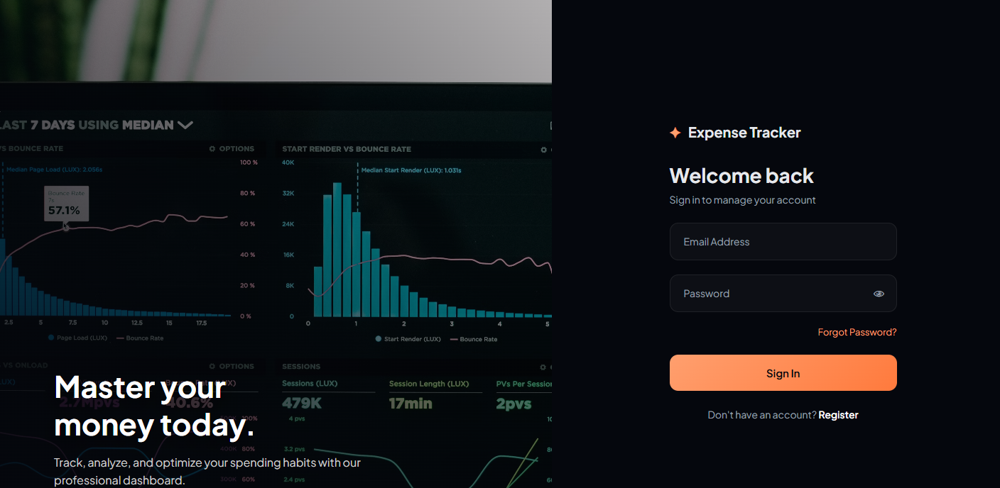
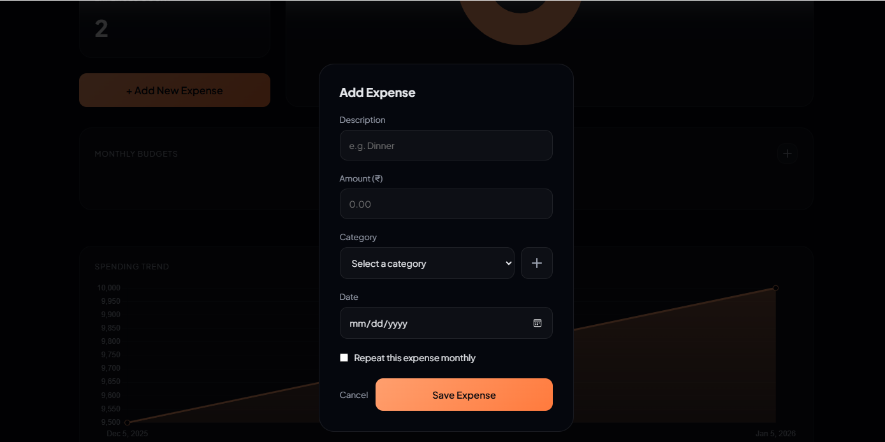

# 💰 Expense Tracker System

A RESTful personal finance management API built with **Spring Boot 4**, **Spring Security (JWT)**, and **H2/JPA**. Track daily expenses, manage category budgets, and configure recurring monthly subscriptions — with a clean dark-themed frontend and Expo React Native mobile app.

---

## 📑 Table of Contents

- [Screenshots](#-screenshots)
- [Tech Stack](#-tech-stack)
- [Mobile App (Expo React Native)](#-mobile-app-expo-react-native)
- [Neon DB & Compute Hours Protection](#-neon-db--compute-hours-protection)
- [Docker & Containerization](#-docker--containerization)
- [Hugging Face Spaces & Netlify Deployment](#-hugging-face-spaces--netlify-deployment)
- [Environment Variables](#-environment-variables)
- [Project Structure](#-project-structure)
- [Getting Started](#-getting-started)
- [API Documentation (Swagger)](#-api-documentation-swagger)
- [Running Tests](#-running-tests)
  - [From the Terminal (Maven)](#1-from-the-terminal-maven)
  - [From IntelliJ IDEA](#2-from-intellij-idea)
  - [From VS Code](#3-from-vs-code)
- [Test Reports](#-test-reports)
- [API Overview](#-api-overview)

---

## 📸 Screenshots

### Register
Create a free account with your name, email, and a password of at least 6 characters.


---

### Login
Sign in with your credentials. A JWT token is issued and used for all subsequent API calls.



---

### Dashboard
The dashboard shows your total spend, number of expenses, a spend-by-category donut chart, your monthly budgets, and a spending trend graph.


---

### Add Expense
Record a new expense by entering a description, amount (₹), category, and date. Tick **Repeat this expense monthly** to register it as a recurring subscription.



---

## 🛠 Tech Stack

| Layer | Technology |
|---|---|
| Language | Java 26 |
| Framework | Spring Boot 4.0.6 |
| Security | Spring Security + JWT (JJWT) + Google OAuth |
| Persistence | Spring Data JPA + Hibernate 7 |
| Database | H2 (in-memory, dev/test), SQLite JDBC, PostgreSQL (Neon) |
| Mobile | React Native 0.81, Expo 54, Expo Router 6 |
| Documentation | SpringDoc OpenAPI 3.0 (Swagger UI) |
| Unit Tests | JUnit 5 + Mockito + MockMvc (`@WebMvcTest`) |
| BDD Tests | Cucumber 7 + RestAssured 5 |
| Build | Maven 3 |

---

## 📱 Mobile App (Expo React Native)

The application includes a mobile client built with **React Native** and **Expo Router**.

### Run Mobile App Locally

```bash
cd mobile
npm install
npx expo start
```

- **Expo Go App**: Scan the QR code shown in the terminal with the Expo Go app (Android) or Camera app (iOS).
- **Web Preview**: Press `w` in terminal or open `http://localhost:8081`.
- **Tunnel Mode**: `npx expo start --tunnel` (for testing across different networks).

---

## ⚡ Neon DB & Compute Hours Protection

To optimize database connections and stay safely within free-tier compute limits (e.g. 100 compute hours/month on Neon PostgreSQL):

```properties
# HikariCP Pool Autosuspend Configuration
spring.datasource.hikari.maximum-pool-size=10
spring.datasource.hikari.minimum-idle=0
spring.datasource.hikari.connection-timeout=5000
spring.datasource.hikari.idle-timeout=120000
spring.datasource.hikari.max-lifetime=600000
```

- **`minimum-idle=0`**: HikariCP drops all connections after 2 minutes of idle time.
- **Autosuspend**: Neon PostgreSQL detects 0 active connections and enters sleep mode, consuming **0 compute hours**.
- **Scheduled Sync**: Background file-to-DB sync is configured hourly (`@Scheduled(cron = "0 0 * * * *")`) to prevent polling the DB continuously.

---

## 🐳 Docker & Containerization

The backend is containerized using a multi-stage `Dockerfile` configured to build and run an executable JAR on port `7860` (optimized for Hugging Face Spaces).

### 1. Build the JAR Locally

Compile and package the Spring Boot application on your host machine:
```bash
./mvnw clean package -DskipTests
```

### 2. Build the Docker Image

Build the container image using the packaged JAR:
```bash
docker build -t expense-tracker-backend .
```

### 3. Run the Container

Run the container locally and map port `7860` to your host:
```bash
docker run -p 7860:7860 \
  -e SPRING_DATASOURCE_URL="jdbc:postgresql://<your-neon-host>/neondb?sslmode=require" \
  -e SPRING_DATASOURCE_USERNAME="your_username" \
  -e SPRING_DATASOURCE_PASSWORD="your_password" \
  -e JWT_SECRET="your_jwt_secret_key" \
  -e CORS_ALLOWED_ORIGINS="http://localhost:5500,http://127.0.0.1:5500" \
  expense-tracker-backend
```

---

## 🚀 Hugging Face Spaces & Netlify Deployment

### Hugging Face Spaces (Backend Container)
- Deployed via multi-stage `Dockerfile` (Maven build + JRE runtime) on port `7860`.
- Includes persistent `expense_tracker.db` SQLite fallback and `expenses_sync.json` auto-sync.

### Netlify (Web Frontend)
- Configured via `netlify.toml` in repository root:
  ```toml
  [build]
    publish = "frontend"

  [[redirects]]
    from = "/api/*"
    to = "https://yoge-2004-expense-tracker-backend.hf.space/api/:splat"
    status = 200
  ```

---

## 🔑 Environment Variables

The application can be configured in production (such as on Hugging Face Spaces or inside Docker containers) using the following environment variables:

| Environment Variable | Default Value | Description | Production Example |
| --- | --- | --- | --- |
| `SPRING_DATASOURCE_URL` | `jdbc:h2:mem:expensetrackerdb` | JDBC connection URL for the database | `jdbc:postgresql://ep-flat-water-123456.us-east-2.aws.neon.tech/neondb?sslmode=require` |
| `SPRING_DATASOURCE_DRIVER_CLASS_NAME` | `org.h2.Driver` | JDBC driver class name | `org.postgresql.Driver` |
| `SPRING_DATASOURCE_USERNAME` | `sa` | Database user account name | `yoge_admin` |
| `SPRING_DATASOURCE_PASSWORD` | *(empty)* | Database user account password | `my_secure_db_password` |
| `SPRING_JPA_DATABASE_PLATFORM` | `org.hibernate.dialect.H2Dialect` | Hibernate dialect for database-specific SQL queries | `org.hibernate.dialect.PostgreSQLDialect` |
| `SPRING_SQL_INIT_MODE` | `always` | Controls whether SQL seeding scripts (`data.sql`) run | `always` (or `never` after first seed) |
| `SPRING_H2_CONSOLE_ENABLED` | `true` | Enables/disables the web-based H2 database console | `false` |
| `CORS_ALLOWED_ORIGINS` | `http://127.0.0.1:5500,http://localhost:5500,http://localhost:3000` | Comma-separated client URLs permitted for CORS access | `https://cozy-narwhal-3099ad.netlify.app` |
| `JWT_SECRET` | *(default secure hex)* | 256-bit hex key to sign and verify JSON Web Tokens | `d3f9b2...` *(generate a secure random 64-character hex string)* |

---

## 📁 Project Structure

```
expense-tracker/
├── frontend/                    # Web frontend (HTML, CSS, JS, Chart.js)
├── mobile/                      # Expo React Native mobile application
│   ├── app/                     # Expo Router screens (login, register, tabs)
│   ├── context/                 # AuthContext & Theme Provider
│   └── services/                # API service layer with 503 error handling
├── screenshots/                 # UI screenshots (register, login, dashboard, add_expense)
├── src/
│   ├── main/
│   │   ├── java/com/example/expensetracker/
│   │   │   ├── config/          # SecurityConfig, SwaggerConfig, CorsConfig
│   │   │   ├── controller/      # REST controllers (Auth, Expense, Category, Sync, Health, User)
│   │   │   ├── dto/             # Request/Response DTOs with @Schema annotations
│   │   │   ├── exception/       # GlobalExceptionHandler
│   │   │   ├── mapper/          # Entity ↔ DTO mappers
│   │   │   ├── model/           # JPA entities
│   │   │   ├── repository/      # Spring Data JPA repositories
│   │   │   ├── scheduler/       # Recurring expense scheduler
│   │   │   └── service/         # Business logic & FileDbSyncService
│   │   └── resources/
│   │       ├── application.properties
│   │       ├── application-sqlite.properties
│   │       └── data.sql         # Seeds global categories on startup
│   └── test/
│       ├── java/com/example/expensetracker/
│       │   ├── controller/      # JUnit @WebMvcTest tests (54 tests)
│       │   └── cucumber/        # Cucumber runner, config, step definitions
│       │       ├── context/     # ScenarioContext (@ScenarioScope)
│       │       └── steps/       # Step definition classes (7 files)
│       └── resources/
│           ├── features/        # Gherkin .feature files (71 scenarios)
│           ├── cucumber.properties
│           └── application.properties  # Test-specific overrides
├── Dockerfile                   # Multi-stage Dockerfile for HF Spaces
├── netlify.toml                 # Netlify deployment configuration
├── expense_tracker.db           # SQLite database file
├── run-tests.sh                 # Convenience script (colour output)
└── pom.xml
```

---

## 🚀 Getting Started

### Prerequisites

- **Java 17+** (project targets Java 26; Java 17–26 all work)
- **Maven 3.8+**

### Clone & run

```bash
git clone https://github.com/Yoge-2004/expense-tracker.git
cd expense-tracker
mvn spring-boot:run
```

The application starts on **port 8080** with an in-memory H2 database.
Global expense categories (Food, Transport, Utilities, Entertainment, Health)
are seeded automatically from `data.sql`.

### H2 console (dev only)

```
URL:      http://localhost:8080/h2-console
JDBC URL: jdbc:h2:mem:expensedb
User:     sa   Password: (blank)
```

---

## 📖 API Documentation (Swagger)

Full interactive API documentation is auto-generated by SpringDoc OpenAPI.

| Resource | URL |
|---|---|
| **Swagger UI** | <http://localhost:8080/swagger-ui/index.html> |
| **OpenAPI JSON** | <http://localhost:8080/v3/api-docs> |

### Authenticating in Swagger UI

1. Call **`POST /api/auth/register`** to create an account.
2. Call **`POST /api/auth/login`** — copy the `token` from the response.
3. Click the **Authorize 🔒** button (top-right of the Swagger UI page).
4. Paste the token (without the `Bearer ` prefix) and click **Authorize**.
5. All subsequent requests will include `Authorization: Bearer <token>` automatically.

---

## 🧪 Running Tests

The project has two test suites that run independently:

| Suite | Type | Files | Count |
|---|---|---|---|
| JUnit `@WebMvcTest` | Unit (mocked service layer) | `*ControllerTest.java` | 54 tests |
| Cucumber BDD | Integration (full Spring Boot + H2) | `*.feature` files | 71 scenarios |

---

### 1. From the Terminal (Maven)

#### Run everything

```bash
mvn test
```

#### Run JUnit unit tests only

```bash
mvn test -Dtest="*Test"
```

#### Run Cucumber BDD tests only

```bash
mvn test -Dtest=CucumberTestRunner
```

#### Run a single JUnit test class

```bash
mvn test -Dtest=AuthControllerTest
```

#### Run a single JUnit test method

```bash
mvn test -Dtest="AuthControllerTest#login_validCredentials_returns200WithToken"
```

#### Run the convenience script (colour output + summary)

```bash
chmod +x run-tests.sh
./run-tests.sh
```

---

### 2. From IntelliJ IDEA

#### Running JUnit tests

**Run a single test method:**
1. Open any `*ControllerTest.java` file (e.g. `AuthControllerTest`).
2. Click the green **▶ Run** gutter icon next to any `@Test` method.
3. Select **Run 'methodName()'** from the context menu.

**Run an entire test class:**
1. Open the test class file.
2. Click the green **▶ Run** gutter icon next to the `class` declaration.
3. Or right-click the class name → **Run 'ClassName'**.

**Run all JUnit tests at once:**
1. In the **Project** panel, right-click `src/test/java`.
2. Select **Run 'All Tests'**.

**Run via Maven tool window:**
1. Open **View → Tool Windows → Maven**.
2. Expand **expense-tracker → Lifecycle**.
3. Double-click **test**.

> **Tip:** Press `Ctrl+Shift+F10` (Windows/Linux) or `Ctrl+Shift+R` (macOS) while
> the cursor is inside any test method to run it instantly.

---

#### Running Cucumber BDD tests

**Option A — Run from the Runner class:**
1. Open `src/test/java/.../cucumber/CucumberTestRunner.java`.
2. Click the green **▶ Run** gutter icon next to the `class` declaration.
3. Select **Run 'CucumberTestRunner'**.

**Option B — Run a single `.feature` file:**
1. Install the **Cucumber for Java** plugin:
   `File → Settings → Plugins → search "Cucumber for Java" → Install`.
2. Open any `.feature` file (e.g. `src/test/resources/features/auth.feature`).
3. Click the green **▶ Run** gutter icon next to any `Scenario:` line.
4. Select **Run 'Scenario name'**.

**Option C — Run all feature files:**
1. Right-click the `src/test/resources/features/` folder.
2. Select **Run 'All Features in: features'**
   *(available after installing the Cucumber for Java plugin).*

**Option D — Run via Maven Run Configuration:**
1. Go to **Run → Edit Configurations → + → Maven**.
2. Set **Working directory** to the project root.
3. Set **Command line** to: `test -Dtest=CucumberTestRunner`
4. Click **OK**, then **▶ Run**.

> **Tip:** After installing the Cucumber for Java plugin, press `Ctrl+Shift+F10`
> while the cursor is on a `Scenario:` line to run that scenario directly.

---

### 3. From VS Code

#### Prerequisites — install these extensions:
- **Extension Pack for Java** (Microsoft)
- **Cucumber (Gherkin) Full Support** (Alexander Krechik)
- **Test Runner for Java** (Microsoft)

#### Running JUnit tests

1. Open the **Testing** panel from the left sidebar (⚗️ beaker icon).
2. The test tree shows all `@Test` methods grouped by class.
3. Click **▶** next to any method, class, or the root to run tests at that level.

#### Running Cucumber BDD tests

**Via Maven:**
1. Open the integrated terminal: `` Ctrl+` ``.
2. Run: `mvn test -Dtest=CucumberTestRunner`

**Via the Gherkin extension:**
1. Open any `.feature` file.
2. A **▶ Run Scenario** CodeLens link appears above each `Scenario:`.
3. Click it to run that specific scenario.

---

## 📊 Test Reports

After any test run, reports are written to:

```
target/
├── surefire-reports/           # JUnit XML reports (one file per test class)
│   ├── TEST-AuthControllerTest.xml
│   ├── TEST-CategoryControllerTest.xml
│   └── ...
└── cucumber-reports/
    ├── report.html             # ← Open this in a browser for BDD results
    ├── report.json             # Machine-readable (for CI tools)
    └── report.xml             # JUnit XML format for IDE import
```

Open the Cucumber HTML report:

```bash
# macOS
open target/cucumber-reports/report.html

# Linux
xdg-open target/cucumber-reports/report.html

# Windows
start target/cucumber-reports/report.html
```

---

## 🗺 API Overview

| Method | Endpoint | Auth | Description |
|---|---|---|---|
| `GET` | `/api/health` | ❌ | System & Database Health Check |
| `POST` | `/api/auth/register` | ❌ | Create a new user account |
| `POST` | `/api/auth/login` | ❌ | Authenticate and receive a JWT token |
| `POST` | `/api/auth/oauth/google` | ❌ | Google OAuth authentication |
| `PUT` | `/api/auth/reset-password` | ❌ | Reset password by email |
| `POST` | `/api/sync/file-to-db` | ❌ | Sync JSON file to DB |
| `POST` | `/api/sync/db-to-file` | ❌ | Backup DB to JSON file |
| `POST` | `/api/expenses/user/{userId}` | ✅ | Record a new expense |
| `GET` | `/api/expenses/user/{userId}` | ✅ | List all expenses for a user |
| `PUT` | `/api/expenses/{id}/user/{userId}` | ✅ | Update an expense |
| `DELETE` | `/api/expenses/{id}/user/{userId}` | ✅ | Delete an expense |
| `GET` | `/api/expenses/user/{userId}/export/csv` | ✅ | Export expenses as CSV |
| `GET` | `/api/expenses/user/{userId}/export/json` | ✅ | Export expenses as JSON |
| `GET` | `/api/expenses/user/{userId}/export/pdf` | ✅ | Download PDF expense report |
| `POST` | `/api/expenses/user/{userId}/import/csv` | ✅ | Import expenses from CSV file |
| `POST` | `/api/expenses/user/{userId}/import/json` | ✅ | Import expenses from JSON file |
| `POST` | `/api/expenses/budget/user/{userId}` | ✅ | Set a category budget limit |
| `GET` | `/api/expenses/budget/status/user/{userId}` | ✅ | View budget utilisation |
| `DELETE` | `/api/expenses/budget/{budgetId}` | ✅ | Delete a budget limit |
| `POST` | `/api/expenses/recurring/user/{userId}` | ✅ | Add a recurring subscription |
| `GET` | `/api/expenses/recurring/user/{userId}` | ✅ | List active subscriptions |
| `PUT` | `/api/expenses/recurring/{recId}` | ✅ | Update a subscription |
| `DELETE` | `/api/expenses/recurring/{recId}` | ✅ | Cancel a subscription |
| `POST` | `/api/categories/user/{userId}` | ✅ | Create a personal category |
| `GET` | `/api/categories/user/{userId}` | ✅ | List personal categories |
| `GET` | `/api/categories/global` | ✅ | List system-wide categories |
| `DELETE` | `/api/users/{userId}` | ✅ | Delete account (cascade) |

> ✅ = requires `Authorization: Bearer <token>` header  
> ❌ = public endpoint, no token needed

---

## 📄 Licence

This project is licensed under the **Apache License 2.0** — see the [LICENSE](LICENSE) file for details.
