<div align="center">

# 💰 Expense Tracker

### A complete personal-finance workspace for tracking money, understanding spending, and planning ahead.

**Web • Android/iOS • REST API • Secure Authentication • Reports • Budgets • Savings • Recurring Finance**

<!-- IMAGE PLACEHOLDER: Hero screenshot / website dashboard. Replace with a polished browser screenshot. -->

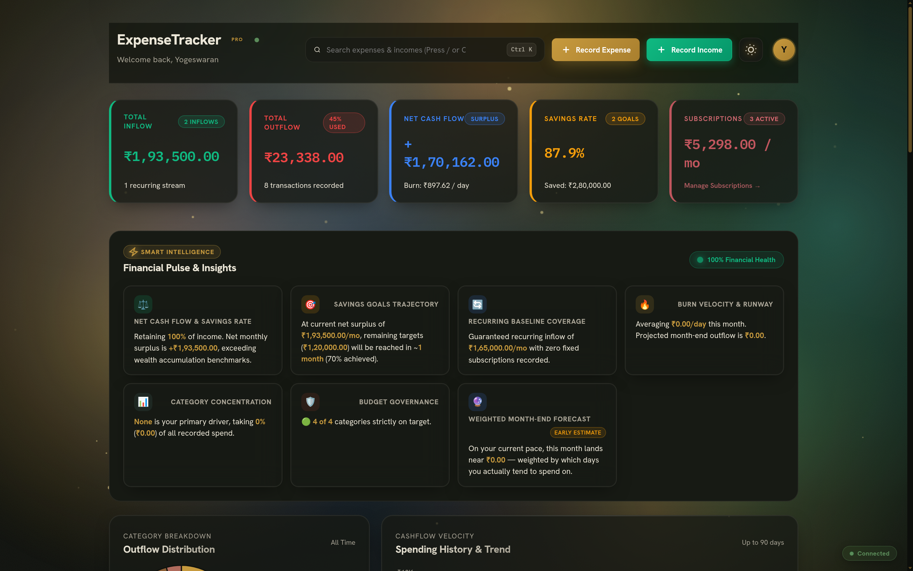

[](https://github.com/Yoge-2004/expense-tracker/actions/workflows/ci.yml)
[](https://github.com/Yoge-2004/expense-tracker/actions/workflows/android-apk.yml)

</div>

---

## ✨ What is Expense Tracker?

Expense Tracker is a full-stack personal-finance application designed around one idea: **your financial data should be easy to record, easy to understand, and useful for making decisions.**

The repository contains three cooperating surfaces:

- 🌐 **Web application** — a responsive browser experience for everyday finance management.
- 📱 **Mobile application** — an Expo + React Native client for recording and reviewing finances on the go.
- ⚙️ **Backend API** — a Spring Boot service that owns authentication, business rules, persistence, reports, and synchronization.

The same backend powers the web and mobile clients, keeping finance data and business logic consistent across devices.

<!-- IMAGE PLACEHOLDER: Three-panel visual showing website, mobile app, and API/backend relationship. -->

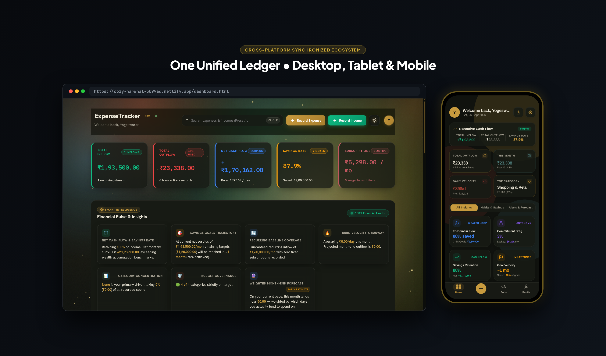

---

## 🧭 Product at a glance

| Area | What you can do |
|---|---|
| **Expenses** | Record, review, update, and organize spending by category. |
| **Recurring expenses** | Mark expenses as recurring monthly commitments/subscriptions. |
| **Income** | Track multiple income streams and review incoming cash flow. |
| **Budgets** | Define category budgets and compare planned vs actual spending. |
| **Savings goals** | Create financial targets and make contributions toward them. |
| **Dashboard** | See spending, income, savings, budgets, trends, and category distribution in one place. |
| **Reports** | Generate downloadable financial reports in PDF and Excel formats. |
| **Authentication** | JWT-based authentication plus Google sign-in and WebAuthn/passkey support in the backend. |
| **Persistence** | H2 for development/testing, SQLite fallback, and PostgreSQL/Neon support for hosted deployments. |
| **Data resilience** | Optional Hugging Face Hub synchronization for SQLite/JSON snapshots. |

---

# 🌐 Web Application

The web client lives in `frontend/` and is a lightweight browser application built with HTML, CSS, and JavaScript. It communicates with the Spring Boot API and is deployable as a static site.

## 🖥️ Web experience

### Authentication

The web experience starts with account creation and sign-in. Authentication establishes the user's session and protects finance data from other accounts.

<!-- IMAGE PLACEHOLDER: Register page screenshot. -->

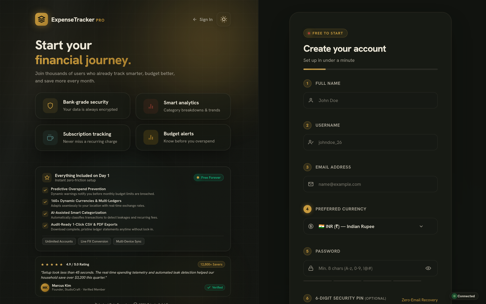

<!-- IMAGE PLACEHOLDER: Login page screenshot, including available authentication options. -->

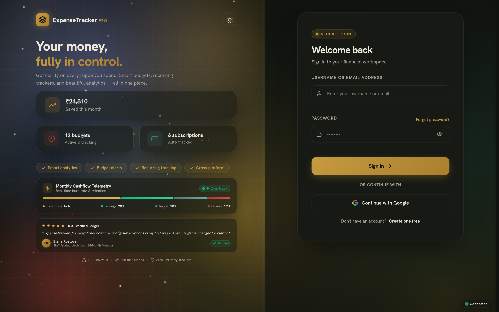

### Dashboard

The dashboard is the application's command center. It brings together high-level financial metrics, spending distribution, trends, and budget information so that the user can understand their current position without opening individual records.

<!-- IMAGE PLACEHOLDER: Full dashboard browser screenshot at desktop width. -->

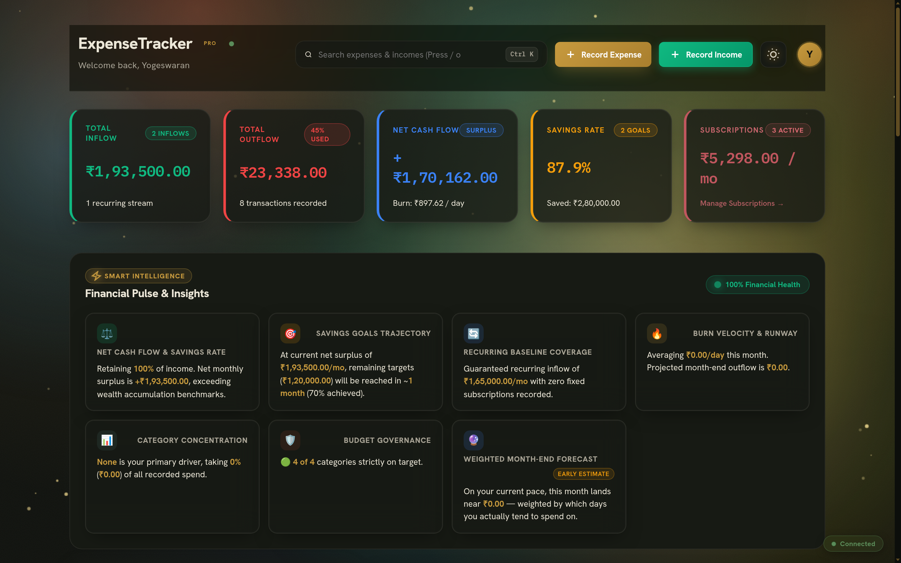

### Expense management

Expenses can be entered with their description, amount, category, and date. Recurring monthly expenses can be identified at creation time so regular commitments are represented in the financial model.

<!-- IMAGE PLACEHOLDER: Add-expense modal/page. -->

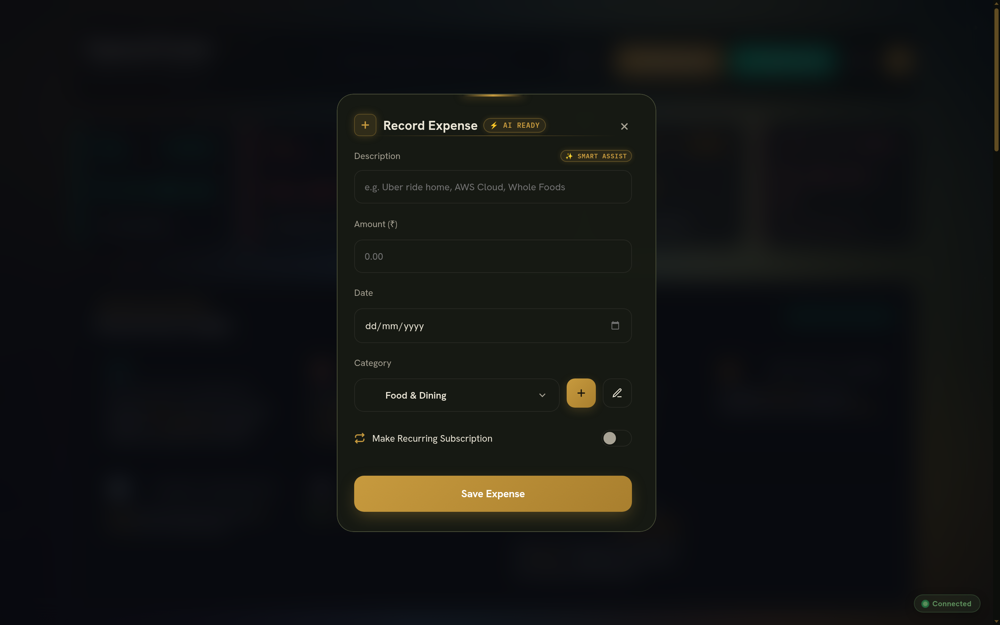

### Categories & budgets

Categories provide structure for spending analysis, while budgets turn that structure into actionable limits. The dashboard can surface category-level spending and budget progress.

<!-- IMAGE PLACEHOLDER: Categories/budgets screen with representative data. -->

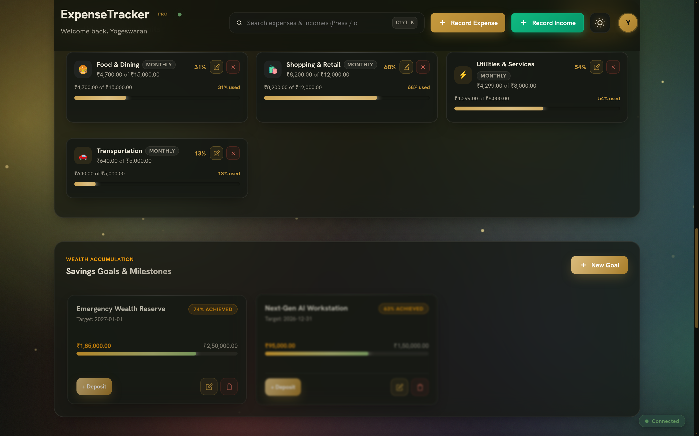

### Income

Income is tracked independently from expenses, allowing the application to represent cash inflows as well as outflows and provide a more complete view of net financial movement.

<!-- IMAGE PLACEHOLDER: Income management screen. -->

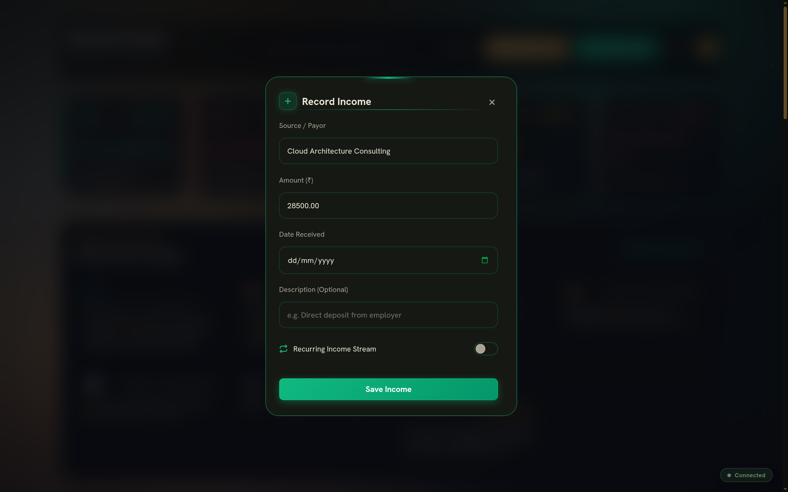

### Savings goals

Savings goals represent longer-term targets. Users can create goals, monitor calculated progress, and make deposit contributions toward the target amount.

<!-- IMAGE PLACEHOLDER: Savings goals screen showing goal progress and a contribution flow. -->

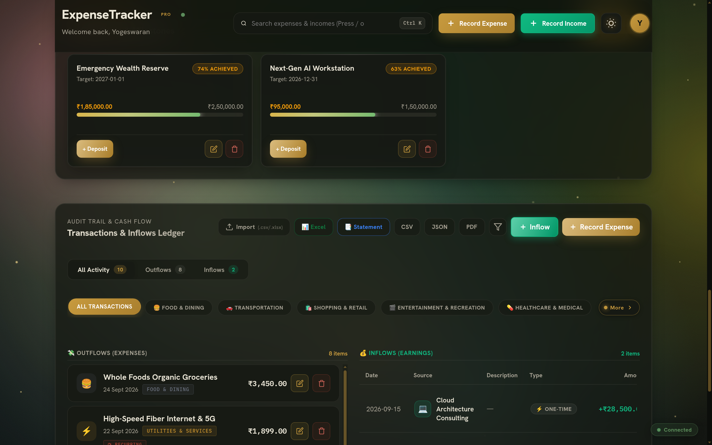

### Reports & exports

The backend provides report generation for financial data, including PDF and Excel export capabilities. This makes the application useful beyond the dashboard itself: data can be archived, shared, or analyzed separately.

<!-- IMAGE PLACEHOLDER: Reports/export UI or generated report preview. -->

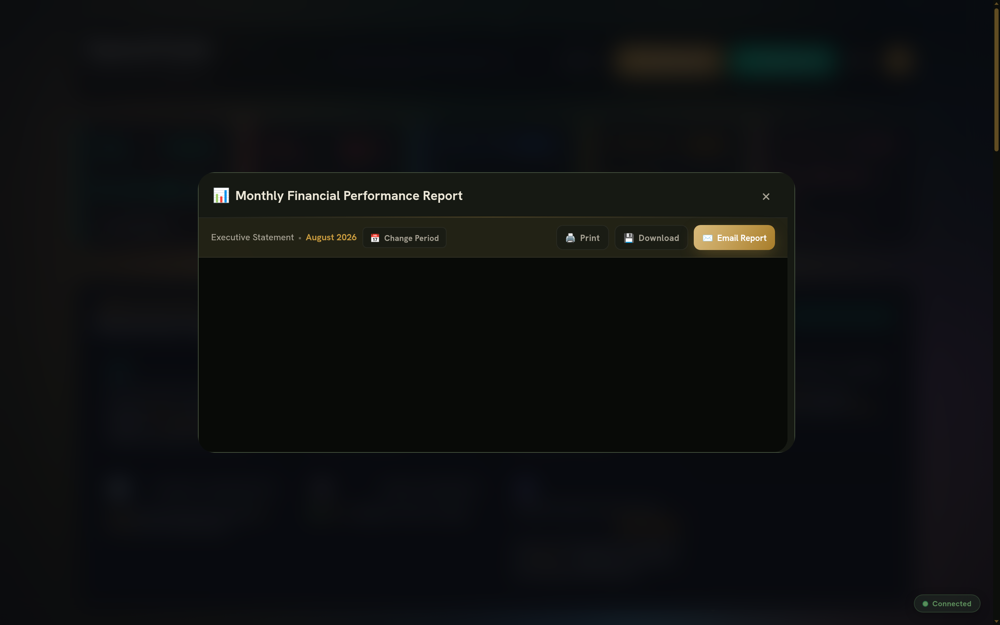

### Responsive design

The web interface is designed to remain usable across desktop and narrow/mobile browser widths. The repository includes browser-oriented checks for important responsive/authentication UI behavior.

<!-- IMAGE PLACEHOLDER: Side-by-side desktop and mobile-width browser screenshots. -->

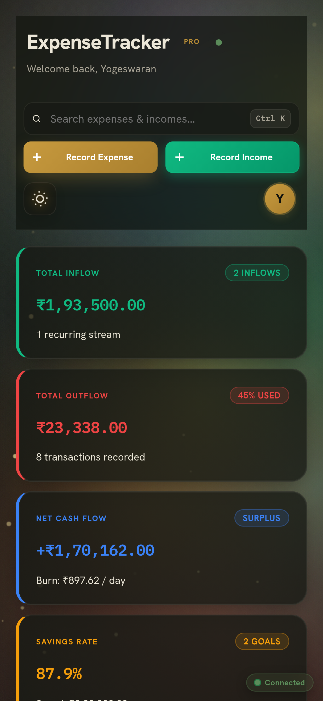

---

# 📱 Mobile Application

The mobile client lives in `mobile/` and uses **Expo, React Native, and Expo Router**. It is a native companion to the web experience rather than a separate product: both clients consume the same backend API.

<!-- IMAGE PLACEHOLDER: Mobile app collage showing authentication, dashboard, expenses, budgets, income and savings. -->

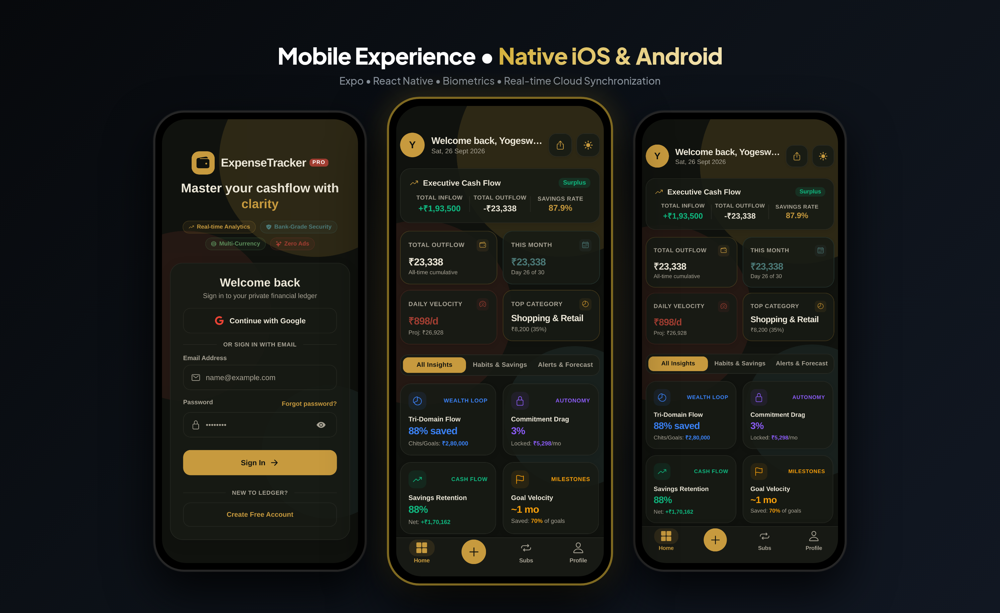

### Mobile authentication

The app supports native Google Sign-In through `@react-native-google-signin/google-signin`, while the backend remains responsible for validating the resulting identity token and issuing the application's authenticated session.

<!-- IMAGE PLACEHOLDER: Mobile Google account chooser followed by successful authentication screen. -->

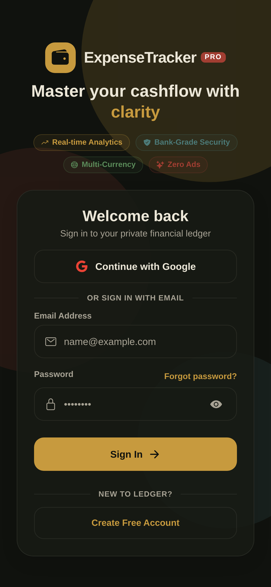

### Mobile navigation

Expo Router organizes the application into navigable screens and tabs. Shared authentication/theme context and a dedicated API service keep screen code focused on presentation and user interaction.

<!-- IMAGE PLACEHOLDER: Mobile navigation/tab layout. -->

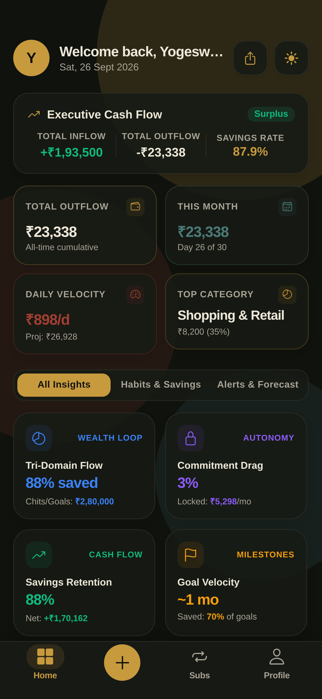

### Mobile finance workflows

The mobile application is intended for quick, frequent interactions: adding an expense, reviewing recent activity, checking budgets, recording income, and monitoring savings progress.

<!-- IMAGE PLACEHOLDER: Mobile expense-entry screenshot. -->

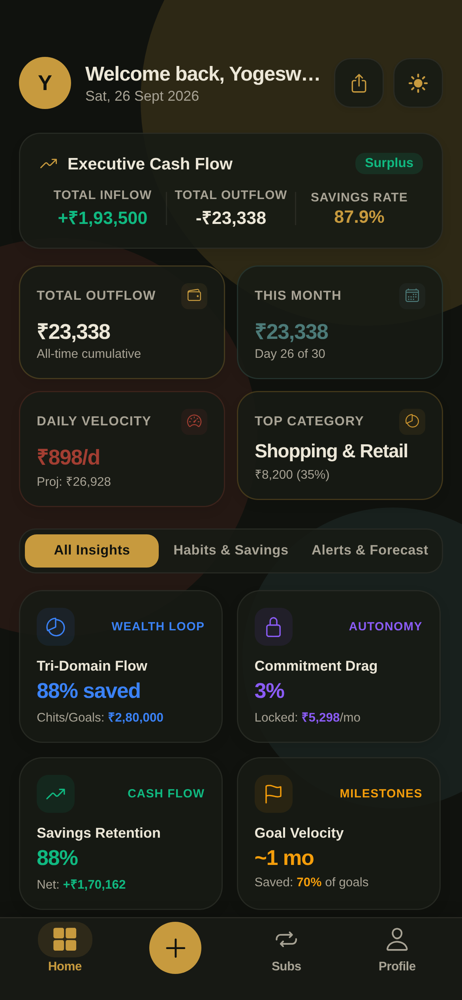

<!-- IMAGE PLACEHOLDER: Mobile dashboard/analytics screenshot. -->

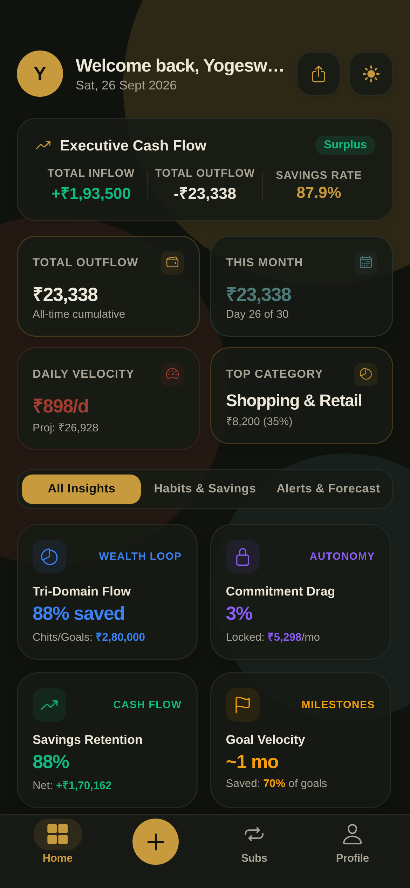

<!-- IMAGE PLACEHOLDER: Mobile savings/budget screenshot. -->


---

# 🏗️ Architecture

Expense Tracker follows a client/API architecture:

```text
┌───────────────────────┐       ┌──────────────────────────┐
│   Web Application     │       │   Expo React Native App  │
│   frontend/           │       │   mobile/                │
└───────────┬───────────┘       └────────────┬─────────────┘
            │                                │
            └──────────────┬─────────────────┘
                           │ HTTP / JSON
                           ▼
                ┌─────────────────────────┐
                │ Spring Boot REST API    │
                │ src/main/java/...       │
                ├─────────────────────────┤
                │ Security / JWT / OAuth  │
                │ Controllers             │
                │ DTOs + Mappers          │
                │ Services + Business     │
                │ Reports + Sync           │
                └────────────┬────────────┘
                             │
                    ┌────────┴────────┐
                    ▼                 ▼
             PostgreSQL / Neon   SQLite / H2
                    │                 │
                    └────────┬────────┘
                             ▼
                   Optional HF snapshots
```

<!-- IMAGE PLACEHOLDER: Replace the ASCII diagram with a polished architecture diagram if desired. -->

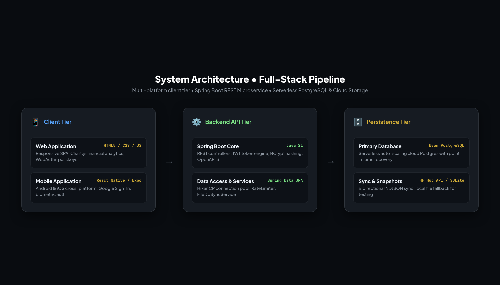

### Backend layers

```text
Controller
   ↓
DTO / Validation
   ↓
Service
   ↓
Repository
   ↓
JPA Entity
   ↓
Database
```

The separation keeps transport concerns, business rules, persistence, and data representation independently testable.

---

# 🔐 Authentication & Security

The backend uses Spring Security and JWT for application authentication. Google identity tokens can be verified server-side, and WebAuthn/passkey endpoints are provided by the backend.

### JWT flow

```text
User → Login/Register → Backend
                         ↓
                    Authenticate
                         ↓
                    Issue JWT
                         ↓
Client stores session token
                         ↓
Authenticated API requests
Authorization: Bearer <token>
```

### Google Sign-In flow

```text
Web / Mobile client
        ↓
Google authentication
        ↓
Google ID token
        ↓
Expense Tracker backend
        ↓
Google ID-token verification
        ↓
Application authentication / JWT
```

For Android builds, the Google Cloud OAuth configuration must match the application's package name and the signing certificate used for the installed APK. The Android package is `com.yoge.expensetracker`.

> **Security note:** never commit JWT secrets, database passwords, SMTP credentials, Hugging Face write tokens, or OAuth client secrets to Git.

---

# 🧩 Core Features

## Expense tracking

- Create and manage expense records.
- Assign expenses to categories.
- Record amount, description, and date.
- Support recurring monthly expense definitions.
- Analyze spending by category and over time.

<!-- IMAGE PLACEHOLDER: Expense list/detail view. -->

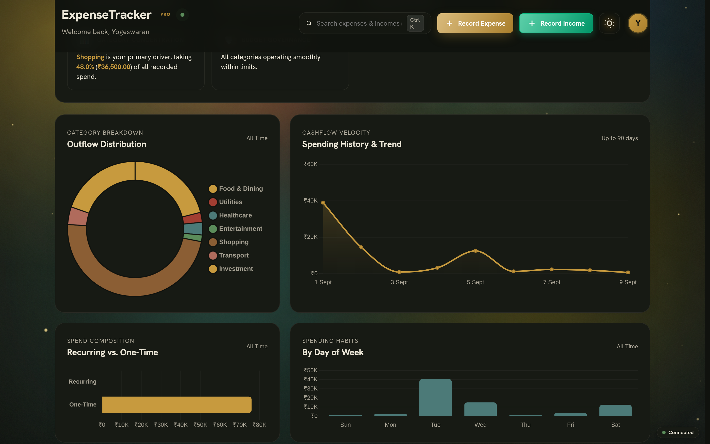

## Budget management

Budgets provide a target for category spending and allow actual expenditure to be compared with planned limits.

<!-- IMAGE PLACEHOLDER: Budget progress visualization. -->

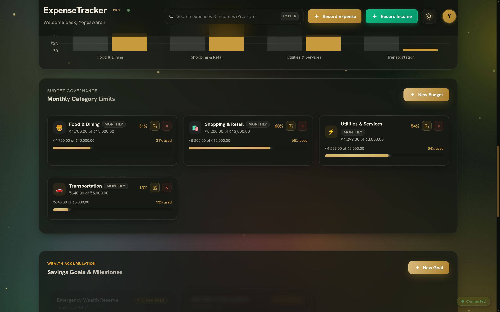

## Income tracking

Income records allow multiple sources of incoming money to be represented separately from spending.

<!-- IMAGE PLACEHOLDER: Income records and summary. -->

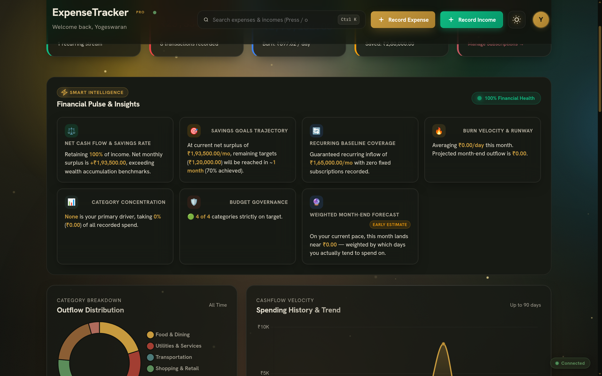

## Savings goals

Savings goals support target amounts, progress calculation, and contribution/deposit workflows.

<!-- IMAGE PLACEHOLDER: Savings goal detail/progress. -->

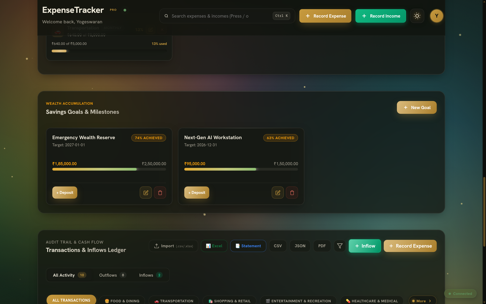

## Recurring finance

Recurring records make regular monthly commitments easier to represent. The backend contains scheduler support for recurring financial workflows.

<!-- IMAGE PLACEHOLDER: Recurring expense/subscription UI. -->

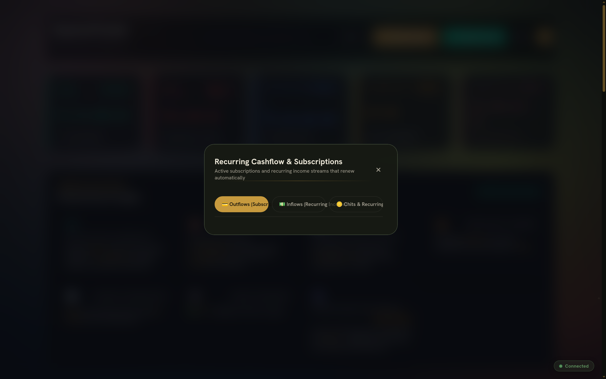

## Reporting

The reporting layer supports generated financial documents, including PDF and Excel exports.

<!-- IMAGE PLACEHOLDER: PDF and Excel export examples. -->

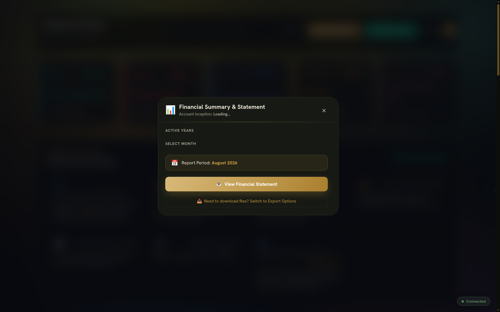

---

# 🛠️ Technology Stack

| Layer | Technology |
|---|---|
| Backend language | Java 26 |
| Backend framework | Spring Boot 4.1.1 |
| Security | Spring Security, JWT (JJWT 0.13.0), Google OAuth, WebAuthn |
| Persistence | Spring Data JPA / Hibernate |
| Databases | H2, SQLite, PostgreSQL / Neon |
| Reporting | OpenPDF 3.0.5, Apache POI 5.5.1 |
| API documentation | SpringDoc OpenAPI 3.1.0 / Swagger UI |
| Web | HTML, CSS, JavaScript, Chart.js where used by the frontend |
| Mobile | React Native 0.86.3, Expo 57, Expo Router |
| Mobile auth | `@react-native-google-signin/google-signin` |
| Testing | JUnit, Mockito, MockMvc, Cucumber, REST-Assured, Selenium, HtmlUnit |
| Build | Maven |
| Container | Docker / Eclipse Temurin JRE 26 |
| Backend hosting | Hugging Face Spaces |
| Web hosting | Netlify |

---

# 📂 Repository Structure

```text
expense-tracker/
├── frontend/                    # Browser application
│   ├── css/                     # UI styles
│   ├── js/                      # Browser logic and API interaction
│   └── index.html               # Main web entry point
│
├── mobile/                      # Expo React Native application
│   ├── app/                     # Expo Router screens/routes
│   ├── components/              # Reusable mobile UI
│   ├── constants/               # API/auth/config constants
│   ├── context/                 # Authentication/theme state
│   └── services/                # Backend/API integrations
│
├── src/main/java/               # Spring Boot production code
│   └── com/example/expensetracker/
│       ├── config/              # Security, CORS, Swagger, initialization
│       ├── controller/           # REST endpoints
│       ├── dto/                  # Request/response models
│       ├── exception/            # Global exception handling
│       ├── mapper/               # Entity ↔ DTO mapping
│       ├── model/                # JPA entities
│       ├── repository/           # Spring Data repositories
│       ├── scheduler/            # Scheduled financial workflows
│       └── service/              # Business logic and sync
│
├── src/test/                    # Backend tests and BDD scenarios
├── docs/images/                 # README visual assets/placeholders
├── Dockerfile                   # Hugging Face production container
├── netlify.toml                 # Web deployment configuration
├── pom.xml                      # Maven project configuration
└── run-tests.sh                 # Test convenience script
```

---

# 🚀 Run the Web + Backend Locally

## Prerequisites

- Java 26 (the backend targets Java 26)
- Maven 3.9+ or the included Maven Wrapper
- A modern browser
- Node.js/npm if working on the mobile client

## Start the backend

```bash
git clone https://github.com/Yoge-2004/expense-tracker.git
cd expense-tracker
./mvnw spring-boot:run
```

The backend starts on port `8080` using the project's development configuration.

<!-- IMAGE PLACEHOLDER: Terminal + running Swagger/backend screenshot. -->

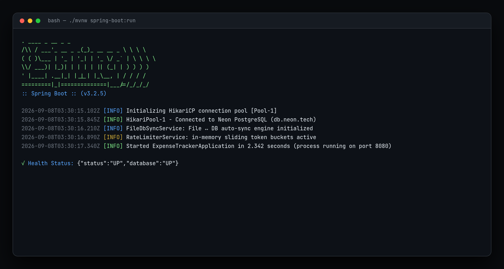

## Open the web application

Serve the `frontend/` directory using a local static server, then configure the frontend API origin as appropriate for your environment.

Example:

```bash
cd frontend
python -m http.server 5500
```

Open the displayed local URL in a browser.

<!-- IMAGE PLACEHOLDER: Website running locally in browser. -->

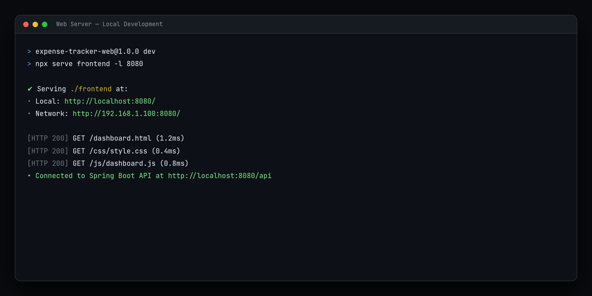

---

# 📱 Run the Mobile App Locally

```bash
cd mobile
npm install
npx expo start
```

Useful commands:

```bash
npm run android
npm run ios
npm run web
npm run ts:check
```

Expo Go can be used for compatible development workflows; native Google Sign-In behavior should be validated using an appropriate native development/release build rather than assuming Expo Go reproduces native OAuth configuration.

<!-- IMAGE PLACEHOLDER: Expo terminal/QR and mobile running screenshot. -->

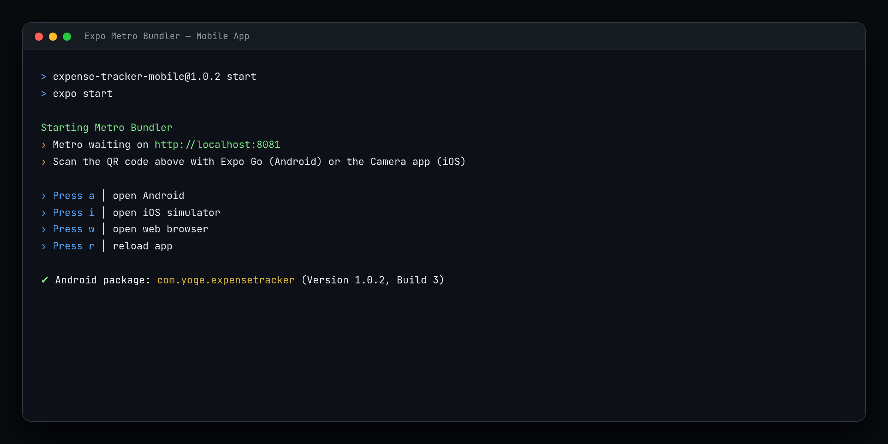

---

# ⚙️ Environment Configuration

Production secrets belong in the hosting environment, not in source control.

| Variable | Purpose |
|---|---|
| `SPRING_DATASOURCE_URL` | JDBC URL for the active database. |
| `SPRING_DATASOURCE_DRIVER_CLASS_NAME` | JDBC driver class. |
| `SPRING_DATASOURCE_USERNAME` | Database username. |
| `SPRING_DATASOURCE_PASSWORD` | Database password. |
| `SPRING_JPA_DATABASE_PLATFORM` | Hibernate database dialect. |
| `CORS_ALLOWED_ORIGINS` | Comma-separated browser origins allowed by CORS. |
| `JWT_SECRET` | Secret used to sign application JWTs. |
| `GOOGLE_OAUTH_CLIENT_ID` | Google Web OAuth client ID used for backend token audience verification. |
| `HF_TOKEN` | Hugging Face token used by optional snapshot synchronization. |
| `HF_SPACE_REPO` | Target Hugging Face repository, normally `Yoge-2004/expense-tracker-backend`. |
| `HF_SYNC_ENABLED` | Enables Hugging Face persistence synchronization. |

### Example development configuration

```properties
SPRING_DATASOURCE_URL=jdbc:h2:mem:expensetrackerdb
SPRING_DATASOURCE_USERNAME=sa
SPRING_DATASOURCE_PASSWORD=
JWT_SECRET=<generate-a-secret>
GOOGLE_OAUTH_CLIENT_ID=<google-web-client-id>
```

Do not copy real production credentials into this example.

<!-- IMAGE PLACEHOLDER: Environment/secrets configuration screen with secrets redacted. -->

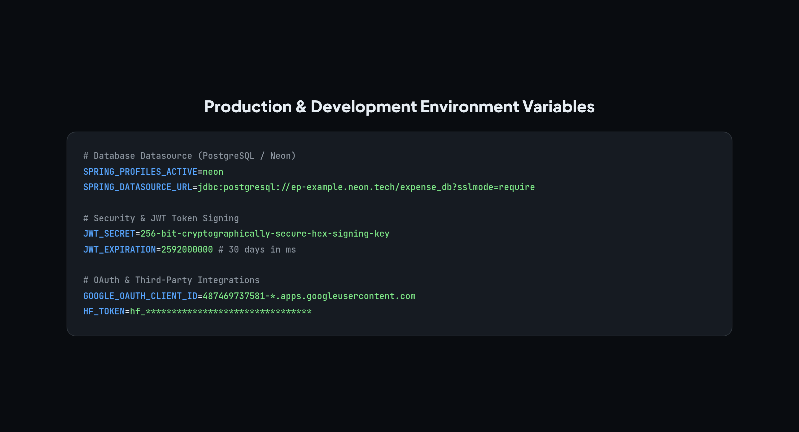

---

# 🐳 Docker

The repository includes a production-oriented Dockerfile for Hugging Face Spaces. The container uses Eclipse Temurin JRE 26, exposes port `7860`, and runs the application as UID `1000`.

Build the backend JAR:

```bash
./mvnw clean package -DskipTests
```

Build the image:

```bash
docker build -t expense-tracker-backend .
```

Run it locally:

```bash
docker run --rm -p 7860:7860 \
  -e SPRING_DATASOURCE_URL="<jdbc-url>" \
  -e SPRING_DATASOURCE_USERNAME="<username>" \
  -e SPRING_DATASOURCE_PASSWORD="<password>" \
  -e JWT_SECRET="<secret>" \
  expense-tracker-backend
```

The Docker image expects the compiled artifact at `/app/app.jar`.

<!-- IMAGE PLACEHOLDER: Docker build/run screenshot or container architecture visual. -->

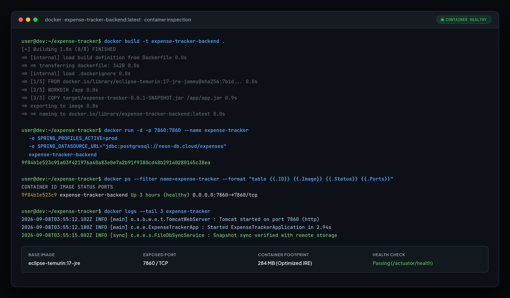

---

# ☁️ Deployment

## Web → Netlify

The root `netlify.toml` configures the static web deployment and API proxy behavior. The frontend is published from `frontend/`.

## Backend → Hugging Face Spaces

The backend is packaged as a Docker Space. The container listens on port `7860` and starts the Spring Boot executable JAR.

<!-- IMAGE PLACEHOLDER: Hugging Face Space running successfully. -->

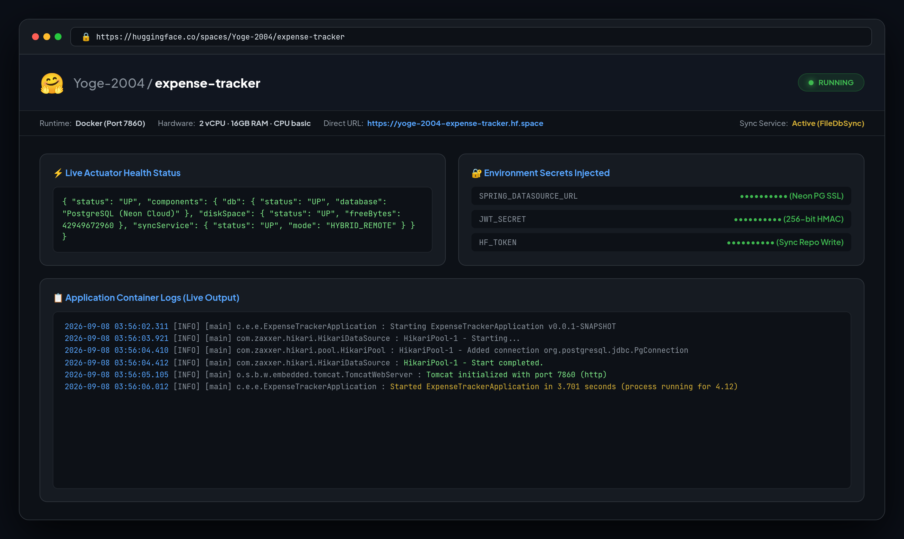

## Database → PostgreSQL / Neon

PostgreSQL can be used as the production database. Connection pooling is configured to avoid keeping unnecessary idle connections alive.

<!-- IMAGE PLACEHOLDER: Production architecture/deployment overview. -->

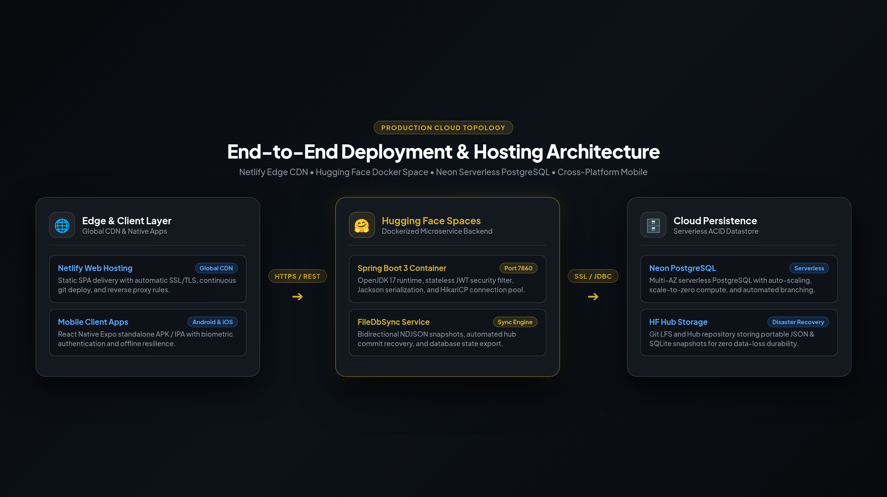

---

# 🔄 Data Persistence & Hugging Face Sync

Hosted containers may have ephemeral local storage. The project therefore includes an optional synchronization mechanism based on:

- `expense_tracker.db` — SQLite database snapshot.
- `expenses_sync.json` — portable JSON snapshot.
- Hugging Face Hub commit/download operations through `FileDbSyncService`.

When enabled, the application can pull persisted snapshots and push updated snapshots back to the configured Hugging Face repository.

Available synchronization endpoints are under `/api/sync` and include file-to-database, database-to-file, push-to-Hugging-Face, and pull-from-Hugging-Face operations.

<!-- IMAGE PLACEHOLDER: Data persistence flow diagram. -->

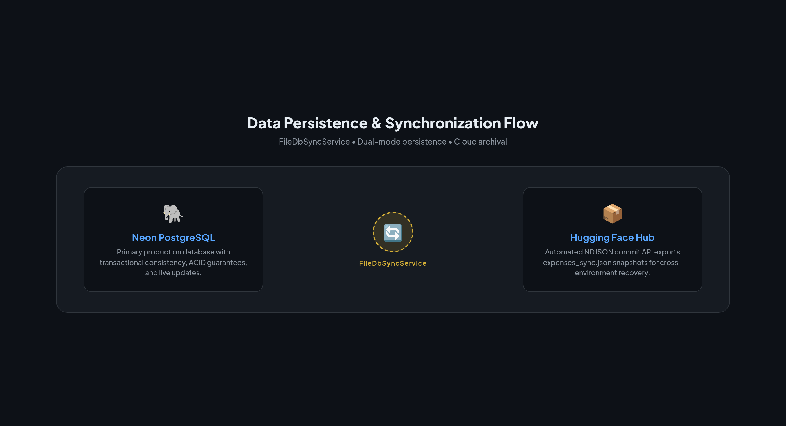

> Treat synchronized database files as application data, not as a substitute for a dedicated production database backup strategy.

---

# 📚 API Documentation

The backend exposes OpenAPI documentation through SpringDoc.

When running locally:

- Swagger UI: `http://localhost:8080/swagger-ui/index.html`
- OpenAPI JSON: `http://localhost:8080/v3/api-docs`

Typical authentication workflow:

1. Register with `POST /api/auth/register`.
2. Log in with `POST /api/auth/login`.
3. Copy the returned JWT.
4. Click **Authorize** in Swagger UI.
5. Enter the token without duplicating the `Bearer` prefix.
6. Call authenticated endpoints.

<!-- IMAGE PLACEHOLDER: Swagger UI screenshot showing authenticated API operations. -->

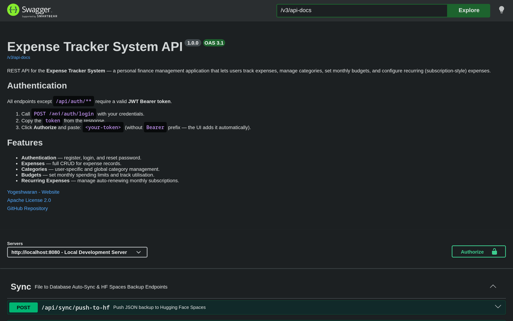

---

# 🗺️ API Surface

The API is organized around domain resources rather than one large controller.

| Resource | Base path | Purpose |
|---|---|---|
| Authentication | `/api/auth` | Registration, login, identity authentication. |
| Users | `/api/users` | Authenticated user/profile operations. |
| Expenses | `/api/expenses` | Expense records and spending workflows. |
| Categories | `/api/categories` | Expense/category management. |
| Income | `/api/incomes` | Income records and cash inflow workflows. |
| Savings | `/api/savings/goals` | Savings goals and contributions. |
| Reports | `/api/reports` | Financial report generation/export. |
| Health | `/api/health` | Application/database health checks. |
| WebAuthn | `/api/webauthn` | Passkey/WebAuthn operations. |
| Sync | `/api/sync` | File/database/Hugging Face synchronization. |

For the authoritative request/response schemas, use Swagger/OpenAPI generated directly from the running backend.

---

# 🧪 Testing

The repository uses multiple test layers so that business logic, HTTP contracts, integrations, and browser behavior can be checked independently.

| Layer | Tooling | Focus |
|---|---|---|
| Unit | JUnit + Mockito | Business/service behavior. |
| Controller | MockMvc / `@WebMvcTest` | HTTP endpoints and validation. |
| BDD | Cucumber | Human-readable end-to-end scenarios. |
| API integration | REST-Assured | HTTP-level integration behavior. |
| Browser | Selenium / HtmlUnit | Frontend/authentication and responsive UI behavior. |
| Static checks | TypeScript + JavaScript syntax checks | Client-side correctness. |

Run the complete Maven suite:

```bash
./mvnw test
```

Run the mobile TypeScript check:

```bash
cd mobile
npm ci
npm run ts:check
```

Run the convenience script:

```bash
./run-tests.sh
```

<!-- IMAGE PLACEHOLDER: CI checks / test report screenshot. -->

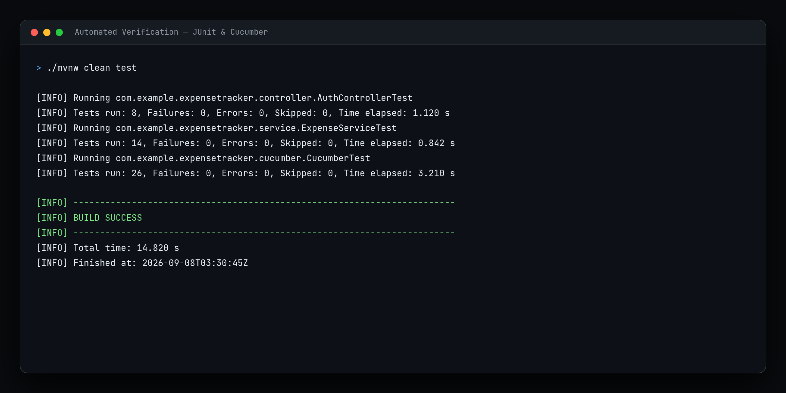

---

# 🔁 Development Workflow

A typical contribution cycle looks like:

```text
Create feature/fix
      ↓
Update backend and/or client
      ↓
Run local checks
      ↓
Run automated test suite
      ↓
Review UI on web + mobile when relevant
      ↓
Commit
      ↓
GitHub Actions
      ↓
Deploy affected surface
```

<!-- IMAGE PLACEHOLDER: GitHub Actions workflow success screenshot. -->

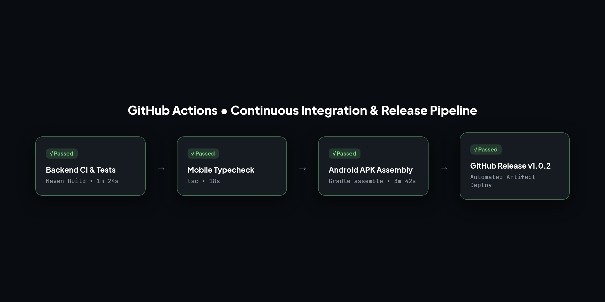

---

# 🖼️ README Image Map

The repository intentionally reserves visual slots so the documentation can evolve into a visual product guide instead of becoming a wall of text.

**Instructions for replacing placeholders:**

1. Capture real browser-rendered website screens.
2. Capture real native mobile screens from the application.
3. Keep screenshots clean: realistic sample data, no secrets, no personal information.
4. Prefer consistent viewport/device framing.
5. Replace files under `docs/images/...` while preserving the paths used by this README, or update the paths together.

Suggested asset map:

```text
docs/images/
├── website/
│   ├── hero-dashboard.png
│   ├── platform-overview.png
│   ├── auth-register.png
│   ├── auth-login.png
│   ├── dashboard.png
│   ├── add-expense.png
│   ├── budgets.png
│   ├── income.png
│   ├── savings-goals.png
│   ├── reports.png
│   ├── responsive.png
│   ├── expenses.png
│   ├── budget-progress.png
│   ├── income-detail.png
│   ├── savings-detail.png
│   ├── recurring.png
│   └── report-exports.png
├── mobile/
│   ├── app-collage.png
│   ├── auth.png
│   ├── navigation.png
│   ├── add-expense.png
│   ├── dashboard.png
│   └── planning.png
├── architecture/
│   ├── system-architecture.png
│   └── data-sync.png
└── development/
    ├── backend-running.png
    ├── web-local.png
    ├── mobile-running.png
    ├── environment.png
    ├── swagger.png
    ├── tests.png
    └── ci.png
```

---

# 📦 Releases

Download the latest Android builds, view release notes, checksums, and previous versions from the official GitHub Releases page.

**👉 [View all releases](https://github.com/Yoge-2004/expense-tracker/releases)**

---

# 🤝 Contributing

1. Fork the repository.
2. Create a focused branch.
3. Make the smallest coherent change.
4. Add or update tests where behavior changes.
5. Check both web and mobile clients when an API contract changes.
6. Update documentation/screenshots when the user-facing experience changes.
7. Open a pull request with a clear description and verification steps.

---

# 🛡️ Security Principles

- Never commit secrets.
- Use environment variables for production credentials.
- Use strong, unique JWT secrets.
- Restrict CORS to trusted application origins.
- Register OAuth credentials against the correct package/bundle identifier and signing certificate.
- Treat exported reports and database snapshots as sensitive financial data.
- Avoid putting real personal financial information in screenshots, tests, or documentation.

---

# 📄 License

This project is licensed under the **Apache License 2.0**. See [`LICENSE`](LICENSE) for the complete license text.

---

<div align="center">

### 💸 Track it. Understand it. Plan it.

**Expense Tracker** brings everyday spending, income, budgets, savings, and reporting into one connected financial workspace.

</div>
